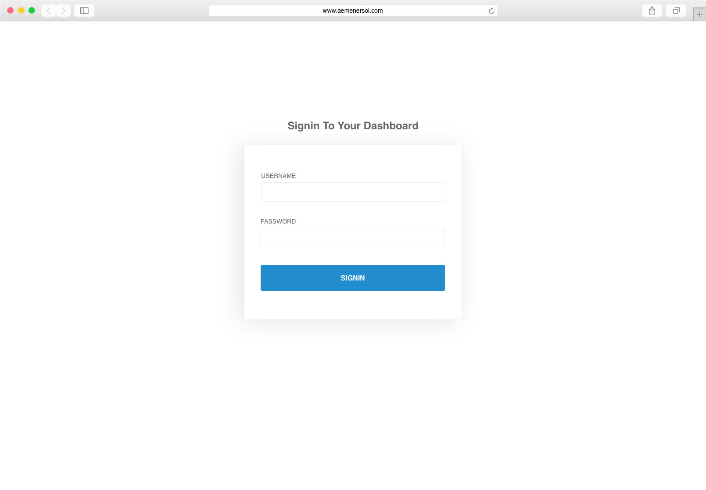
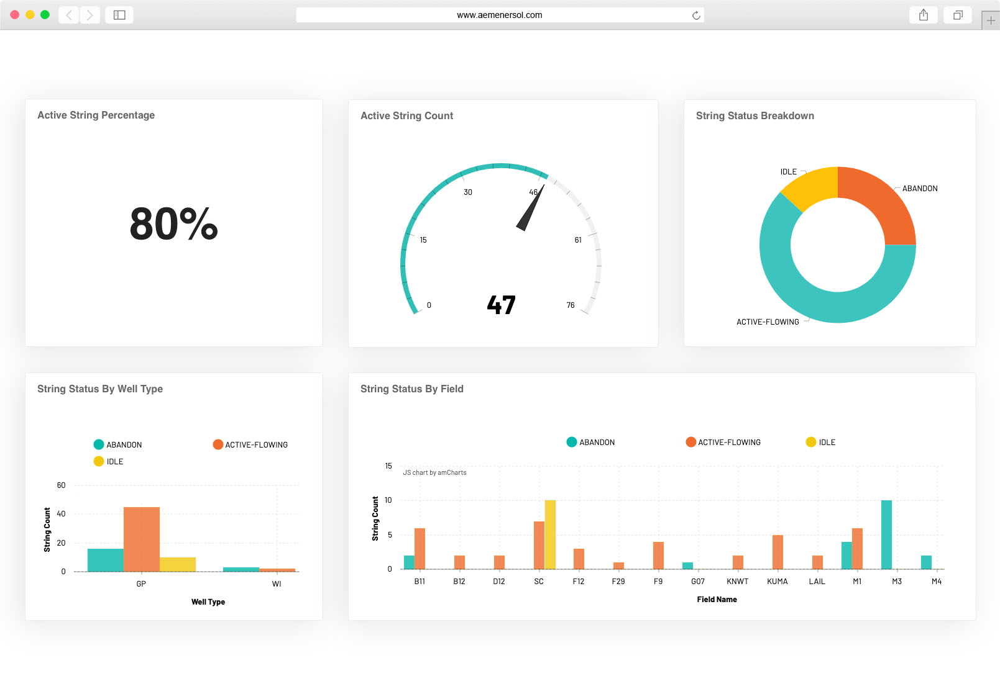

[](http://aemenersol.com)

AEM Enersol is an independent integrated consultancy services, from upstream to downstream. Our impartiality allows us to provide a high quality advise to optimize clients' portfolio in a business. Our principle is grounded in an ultimate priority - achieving clients' needs at beyond the best limit.

# Angular Interview Test

Angular is a platform that makes it easy to build applications with the web. Angular combines declarative templates, dependency injection, end to end tooling, and integrated best practices to solve development challenges. Angular empowers developers to build applications that live on the web, mobile, or the desktop.

## Guideline

You will be given **1 Day** to complete the test. You may use whatever resources you like as long as you are following the below **Tech stack**.

## Tech stack
   - [Angular 6+](https://angular.io/) & [Angular CLI](https://cli.angular.io/)
   - Any UI framework([Foundation](http://foundation.zurb.com/), [Bootstrap 4](https://getbootstrap.com/docs/4.0/getting-started/introduction/), [Semantic-UI](http://semantic-ui.com/))
   - Any charting library([D3](https://d3js.org/), [Plot.ly](https://plot.ly/), [AmCharts](https://www.amcharts.com/)) to visualize some data
   - Stylesheet - [Sass](https://sass-lang.com/)
   - [NPM](https://www.npmjs.com/) for package management
   - [Git](https://git-scm.com/) for source code version control

## Your task

By using the above tech stack, create a dashboard interface that consist of **two**(2) main module (Sign In and Dashboard). The module must consume the API listed in **API section** on each modules. The finished code need to be store/put in your [Github](http://github.com) repository and make it public. Then you will required to give the repository link at the end of this test.

### Sign In

This module is for authenticate user before allowing them to access the **Dashboard** module. Code the **Sign In** module User Interface in Angular using HTML and Sass. Use the below credential to authenticate the user:
  - email: **test@mail.com**
  - password: **test@123ABC**

#### User Interface

[]()

#### API

Endpoint
```
POST: http://wellwarserver.aemenersol.com/api_V1/Account/Login
```
Request Payload
```
{
  email: String,
  password: String
}
 ```
Response
```
{
  "id": String,
  "auth_token": String,
  "dateTimeNow": Date,
  "expires_in": Time,
  "roles": Array,
  "validTo": Date
}
 ```

### Dashboard

This module is for displaying simple overview in form of chart and table/grid. Make sure that this module only accessible when user is authenticated. Any attempt to access this module without authentication should be redirect to **Sign In** module.

#### Interface

[]()

#### API

Endpoint
```
GET: http://wellwarserver.aemenersol.com/api_V1/WellStatus/GetWellStatusDashboard
```
Request Payload
```
{
  "date": "2019-02",
  "cluster_id": ["all"],
  "field_id": ["all"],
  "platform_id": ["all"]
}
```
Response
```
{
  "activeString": Object
  "activeStringCount": Object,
  "stringStatusBreakDown": Object,
  "stringStatusByField": Object,
  "stringStatusByType": Object
}
 ```
